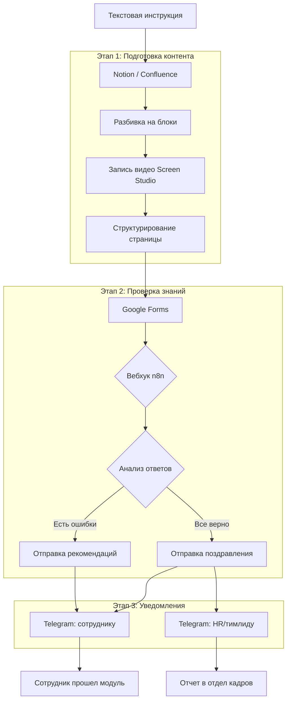

```mermaid

graph TD
    A[Текстовая инструкция] --> B[Notion / Confluence]
    
    subgraph "Этап 1: Подготовка контента"
        B --> C[Разбивка на блоки]
        C --> D[Запись видео Screen Studio]
        D --> E[Структурирование страницы]
    end
    
    subgraph "Этап 2: Проверка знаний"
        F[Google Forms] --> G{Вебхук n8n}
        G --> H{Анализ ответов}
        H -->|Все верно| I[Отправка поздравления]
        H -->|Есть ошибки| J[Отправка рекомендаций]
    end
    
    subgraph "Этап 3: Уведомления"
        I --> K[Telegram: сотруднику]
        J --> K
        I --> L[Telegram: HR/тимлиду]
    end
    
    E --> F
    K --> M[Сотрудник прошел модуль]
    L --> N[Отчет в отдел кадров]

```